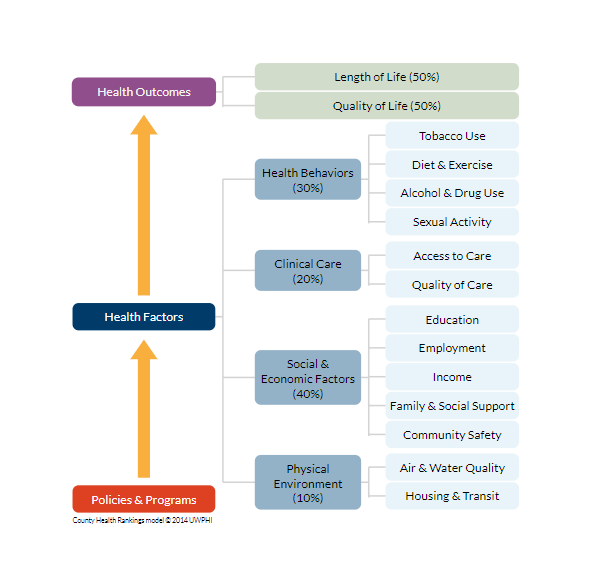
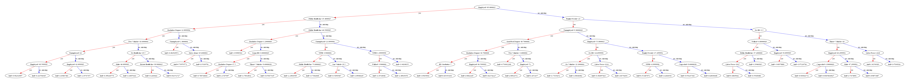

# Life Expectancy Study of Chicago Census Tracts

## Description

The purpose of this project is identify contributing variables to Chicago Census tract life expectancy based off social and economic factors

## Table of Contents

- [Background](#installation)
- [Methodology](#usage)
- [Interpretability](#contributing)
- [Application](#license)
- [Improvements](#improvements)

## Background

[Provide instructions on how to install and set up your project]

## Methodology

[Provide instructions on how to use your project]

## Interpretability

[Provide guidelines for contributing to your project]

## Application

[Specify the license under which your project is distributed]

## Improvements

## Application

[Specify the license under which your project is distributed]

## Improvements

