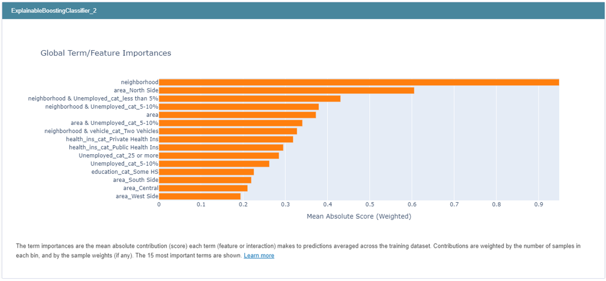

# Life Expectancy Study of Chicago Census Tracts
Michael Goodman, Alejandra Manrique, Zihan Chen

## Description

This project aims to identify contributing variables to life expectancy in Chicago Census tracts based on social and economic factors. Utilizing datasets like the U.S. Life Expectancy at Birth by State and Census Tract, American Community Survey (ACS) data, and the Chicago Data Portal, we explore the impact of Social Determinants of Health (SDOH) on community health outcomes.

## Table of Contents

- [Background](#background)
- [Methodology](#methodology)
- [Interpretability](#interpretability)
- [Application](#application)
- [Improvements](#improvements)

## Background

Our investigation was inspired by models and features used in the County Health Rankings & Roadmaps program by the Robert Wood Johnson Foundation and the University of Wisconsin Population Health Institute. We further delved into the Social Determinants of Health as outlined by Healthy People 2030 to guide our feature selection process.

We obtained data from the CDC, ACS, and the Chicago Data portal. See below for more details

## Methodology

The methodology encompasses data collection from various sources, feature selection based on initial analysis and SDOH categories, and model preparation including exploratory data analysis (EDA), KNN imputation for missing data, and data merging. 

We applied logistic regression, InterpretML Explainable Boosting Machine (EBM) Classifier, and XGBOOST, analyzing with and without Chicago location information to understand its significance on life expectancy. The XGBOOST model's interpretability was enhanced using SHAP (SHapley Additive exPlanations) values to understand the impact of each feature.

## Application

This study provides insights into the critical determinants of life expectancy within Chicago's diverse communities. By identifying key socioeconomic and health-related factors, our findings can inform public health initiatives and policies aimed at improving community health outcomes.

## Takeaway
* **Improving life expectancy in a community area is primarily tied to the employment and income of the community.**

* There are underlying features not captured in the census data, but associated with the neighborhood in Chicago.
* Further studies should be done to identify what features of the neighborhoods result in the disparity, specifically in the south and west sides

## Improvements

Future directions include expanding the dataset to cover more recent years and incorporating additional SDOH factors. Interdisciplinary collaboration and policy development based on our findings could lead to innovative strategies for enhancing life expectancy and health equity.

